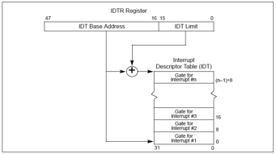
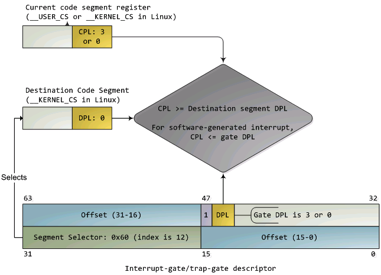

#### 中断与异常

操作系统需要对计算机系统中的各种外设进行管理，这就需要CPU和外设能够相互通信才行。一般外设的速度远慢于CPU的速度。如果让操作系统通过CPU“主动关心”外设的事件，即采用通常的轮询(polling)机制，则太浪费CPU资源了。所以需要操作系统和CPU能够一起提供某种机制，让外设在需要操作系统处理外设相关事件的时候，能够“主动通知”操作系统，即打断操作系统和应用的正常执行，让操作系统完成外设的相关处理，然后在恢复操作系统和应用的正常执行。在操作系统中，这种机制称为中断机制。中断机制给操作系统提供了处理意外情况的能力，同时它也是实现进程/线程抢占式调度的一个重要基石。但中断的引入导致了对操作系统的理解更加困难。

在操作系统中，有三种特殊的中断事件。由CPU外部设备引起的外部事件如I/O中断、时钟中断、控制台中断等是异步产生的（即产生的时刻不确定），与CPU的执行无关，我们称之为异步中断(asynchronous interrupt)也称外部中断,简称中断(interrupt)。而把在CPU执行指令期间检测到不正常的或非法的条件(如除零错、地址访问越界)所引起的内部事件称作同步中断(synchronous interrupt)，也称内部中断，简称异常(exception)。把在程序中使用请求系统服务的系统调用而引发的事件，称作陷入中断(trap interrupt)，也称软中断(soft interrupt)，系统调用(system call)简称trap。在后续试验中会进一步讲解系统调用。

本实验只描述保护模式下的处理过程。当CPU收到中断（通过8259A完成，有关8259A的信息请看附录A）或者异常的事件时，它会暂停执行当前的程序或任务，通过一定的机制跳转到负责处理这个信号的相关处理例程中，在完成对这个事件的处理后再跳回到刚才被打断的程序或任务中。中断向量和中断服务例程的对应关系主要是由IDT（中断描述符表）负责。操作系统在IDT中设置好各种中断向量对应的中断描述符，留待CPU在产生中断后查询对应中断服务例程的起始地址。而IDT本身的起始地址保存在idtr寄存器中。

(1)	中断描述符表（Interrupt Descriptor Table）
中断描述符表把每个中断或异常编号和一个指向中断服务例程的描述符联系起来。同GDT一样，IDT是一个8字节的描述符数组，但IDT的第一项可以包含一个描述符。CPU把中断（异常）号乘以8做为IDT的索引。IDT可以位于内存的任意位置，CPU通过IDT寄存器（IDTR）的内容来寻址IDT的起始地址。指令LIDT和SIDT用来操作IDTR。两条指令都有一个显示的操作数：一个6字节表示的内存地址。指令的含义如下：

- LIDT（Load IDT Register）指令：使用一个包含线性地址基址和界限的内存操作数来加载IDT。操作系统创建IDT时需要执行它来设定IDT的起始地址。这条指令只能在特权级0执行。（可参见libs/x86.h中的lidt函数实现，其实就是一条汇编指令）
- SIDT（Store IDT Register）指令：拷贝IDTR的基址和界限部分到一个内存地址。这条指令可以在任意特权级执行。

IDT和IDTR寄存器的结构和关系如下图所示：

图8 IDT和IDTR寄存器的结构和关系图

在保护模式下，最多会存在256个Interrupt/Exception Vectors。范围[0，31]内的32个向量被异常Exception和NMI使用，但当前并非所有这32个向量都已经被使用，有几个当前没有被使用的，请不要擅自使用它们，它们被保留，以备将来可能增加新的Exception。范围[32，255]内的向量被保留给用户定义的Interrupts。Intel没有定义，也没有保留这些Interrupts。用户可以将它们用作外部I/O设备中断（8259A IRQ），或者系统调用（System Call 、Software Interrupts）等。

(2)	IDT gate descriptors

Interrupts/Exceptions应该使用Interrupt Gate和Trap Gate，它们之间的唯一区别就是：当调用Interrupt Gate时，Interrupt会被CPU自动禁止；而调用Trap Gate时，CPU则不会去禁止或打开中断，而是保留它原来的样子。

> 【补充】所谓“自动禁止”，指的是CPU跳转到interrupt gate里的地址时，在将EFLAGS保存到栈上之后，清除EFLAGS里的IF位，以避免重复触发中断。在中断处理例程里，操作系统可以将EFLAGS里的IF设上,从而允许嵌套中断。但是必须在此之前做好处理嵌套中断的必要准备，如保存必要的寄存器等。二在ucore中访问Trap Gate的目的是为了实现系统调用。用户进程在正常执行中是不能禁止中断的，而当它发出系统调用后，将通过Trap Gate完成了从用户态（ring 3）的用户进程进了核心态（ring 0）的OS kernel。如果在到达OS kernel后禁止EFLAGS里的IF位，第一没意义（因为不会出现嵌套系统调用的情况），第二还会导致某些中断得不到及时响应，所以调用Trap Gate时，CPU则不会去禁止中断。总之，interrupt gate和trap gate之间没有优先级之分，仅仅是CPU在处理中断时有不同的方法，供操作系统在实现时根据需要进行选择。

在IDT中，可以包含如下3种类型的Descriptor：

- Task-gate descriptor （这里没有使用）
- Interrupt-gate descriptor （中断方式用到）
- Trap-gate descriptor（系统调用用到）

下图图显示了80386的任务门描述符、中断门描述符、陷阱门描述符的格式：

图9 X86的各种门的格式

可参见kern/mm/mmu.h中的struct gatedesc数据结构对中断描述符的具体定义。

(3)	中断处理中硬件负责完成的工作

中断服务例程包括具体负责处理中断（异常）的代码是操作系统的重要组成部分。需要注意区别的是，有两个过程由硬件完成：

- 硬件中断处理过程1（起始）：从CPU收到中断事件后，打断当前程序或任务的执行，根据某种机制跳转到中断服务例程去执行的过程。其具体流程如下：
	- CPU在执行完当前程序的每一条指令后，都会去确认在执行刚才的指令过程中中断控制器（如：8259A）是否发送中断请求过来，如果有那么CPU就会在相应的时钟脉冲到来时从总线上读取中断请求对应的中断向量；
	- CPU根据得到的中断向量（以此为索引）到IDT中找到该向量对应的中断描述符，中断描述符里保存着中断服务例程的段选择子；
	- CPU使用IDT查到的中断服务例程的段选择子从GDT中取得相应的段描述符，段描述符里保存了中断服务例程的段基址和属性信息，此时CPU就得到了中断服务例程的起始地址，并跳转到该地址；
	- CPU会根据CPL和中断服务例程的段描述符的DPL信息确认是否发生了特权级的转换。比如当前程序正运行在用户态，而中断程序是运行在内核态的，则意味着发生了特权级的转换，这时CPU会从当前程序的TSS信息（该信息在内存中的起始地址存在TR寄存器中）里取得该程序的内核栈地址，即包括内核态的ss和esp的值，并立即将系统当前使用的栈切换成新的内核栈。这个栈就是即将运行的中断服务程序要使用的栈。紧接着就将当前程序使用的用户态的ss和esp压到新的内核栈中保存起来；
	- CPU需要开始保存当前被打断的程序的现场（即一些寄存器的值），以便于将来恢复被打断的程序继续执行。这需要利用内核栈来保存相关现场信息，即依次压入当前被打断程序使用的eflags，cs，eip，errorCode（如果是有错误码的异常）信息；
	- CPU利用中断服务例程的段描述符将其第一条指令的地址加载到cs和eip寄存器中，开始执行中断服务例程。这意味着先前的程序被暂停执行，中断服务程序正式开始工作。
- 硬件中断处理过程2（结束）：每个中断服务例程在有中断处理工作完成后需要通过iret（或iretd）指令恢复被打断的程序的执行。CPU执行IRET指令的具体过程如下：
	- 程序执行这条iret指令时，首先会从内核栈里弹出先前保存的被打断的程序的现场信息，即eflags，cs，eip重新开始执行；
	- 如果存在特权级转换（从内核态转换到用户态），则还需要从内核栈中弹出用户态栈的ss和esp，这样也意味着栈也被切换回原先使用的用户态的栈了；
	- 如果此次处理的是带有错误码（errorCode）的异常，CPU在恢复先前程序的现场时，并不会弹出errorCode。这一步需要通过软件完成，即要求相关的中断服务例程在调用iret返回之前添加出栈代码主动弹出errorCode。

下图显示了从中断向量到GDT中相应中断服务程序起始位置的定位方式:

图10 中断向量与中断服务例程起始地址的关系

(4)	中断产生后的堆栈栈变化

下图显示了给出相同特权级和不同特权级情况下中断产生后的堆栈栈变化示意图：

图11 相同特权级和不同特权级情况下中断产生后的堆栈栈变化示意图

(5)	中断处理的特权级转换

中断处理得特权级转换是通过门描述符（gate descriptor）和相关指令来完成的。一个门描述符就是一个系统类型的段描述符，一共有4个子类型：调用门描述符（call-gate descriptor），中断门描述符（interrupt-gate descriptor），陷阱门描述符（trap-gate descriptor）和任务门描述符（task-gate descriptor）。与中断处理相关的是中断门描述符和陷阱门描述符。这些门描述符被存储在中断描述符表（Interrupt Descriptor Table，简称IDT）当中。CPU把中断向量作为IDT表项的索引，用来指出当中断发生时使用哪一个门描述符来处理中断。中断门描述符和陷阱门描述符几乎是一样的。中断发生时实施特权检查的过程如下图所示：

图12 中断发生时实施特权检查的过程

门中的DPL和段选择符一起控制着访问，同时，段选择符结合偏移量（Offset）指出了中断处理例程的入口点。内核一般在门描述符中填入内核代码段的段选择子。产生中断后，CPU一定不会将运行控制从高特权环转向低特权环，特权级必须要么保持不变（当操作系统内核自己被中断的时候），或被提升（当用户态程序被中断的时候）。无论哪一种情况，作为结果的CPL必须等于目的代码段的DPL。如果CPL发生了改变，一个堆栈切换操作（通过TSS完成）就会发生。如果中断是被用户态程序中的指令所触发的（比如软件执行INT n生产的中断），还会增加一个额外的检查：门的DPL必须具有与CPL相同或更低的特权。这就防止了用户代码随意触发中断。如果这些检查失败，会产生一个一般保护异常（general-protection exception）。
